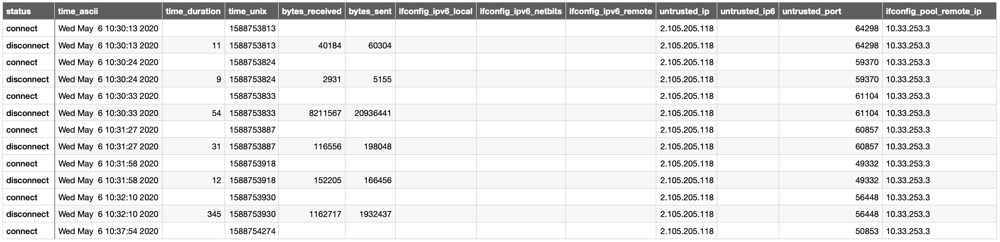

# Readme

This is a statically build command for `openvpn` `--client-connect` and `--client-disconnect` when openvpn is running in a `chroot`. It reads some of the parameters supplied by `openvpn` upon client connect and disconnect, and stores the information in a semicolon separated file for each `common_name` (user)
The file is written to `/openvpn_statistic/${common_name}.csv` with no error handling; the command exit status is always 0, to avoid OpenVPN denying access due to script errors.

On OpenBSD the `/etc/rc.conf.local` should be similar to

````bash
...
openvpn_flags--config="--dev tun2 --config /usr/local/etc/openvpn/server.conf --script-security 2 --client-connect /bin/connect --client-disconnect /bin/disconnect"
...
````
OpenBSD 6.5 doesn't handle flags with parameters well, so e.g. `--client-connect '/bin/command disconnect'` prevents OpenVPN from starting

While the `chroot` in e.g. `/var/openvpn/server` should have a similar setup

````bash
/var/openvpn/server
|-- ccd
|-- crl.pem
|-- bin/occd
|-- bin/connect
|-- bin/disconnect
|-- openvpn_statistic
|   `-- user1_device.csv
|   `-- user2_device.csv
|   `-- user3_device.csv
`-- tmp
````

Where `connect` and `disconnect` are symbolic links to `occd`.

A pretty print of the content is



The content may be used to advise VPN users on their usage and login history while limiting the information when coming from an already known source address.

Comping and cross compiling see `Makefile`
